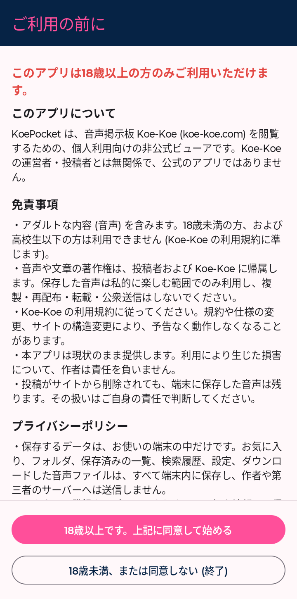
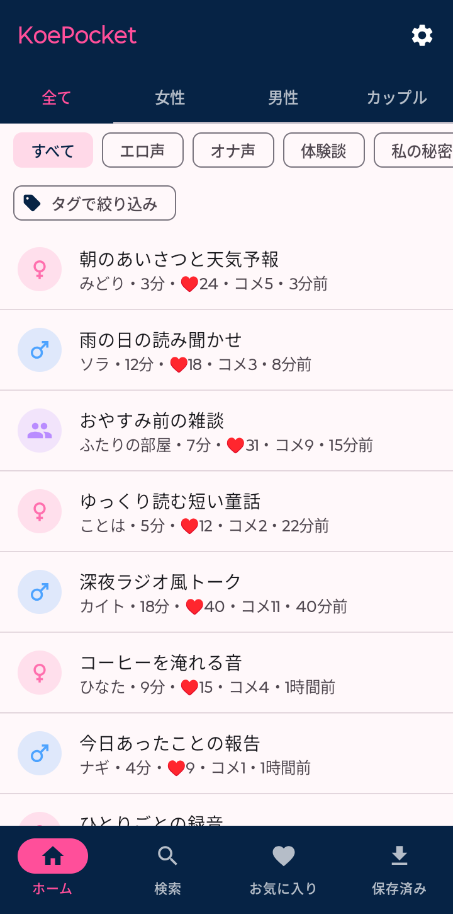
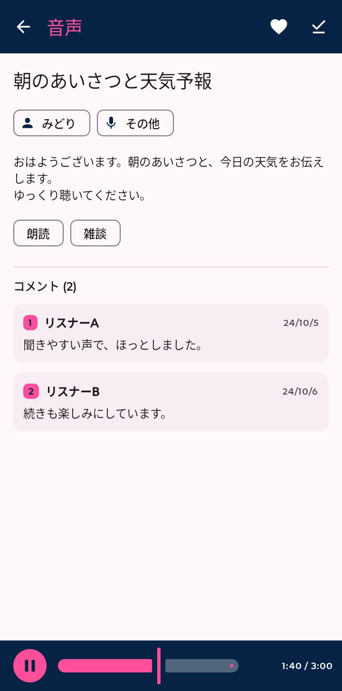
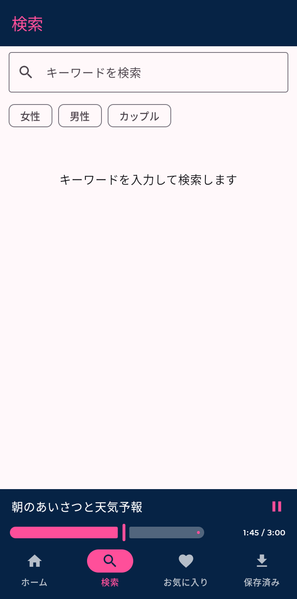
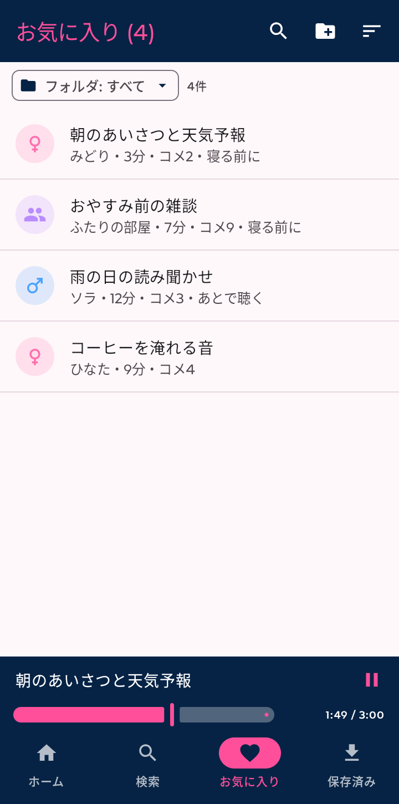
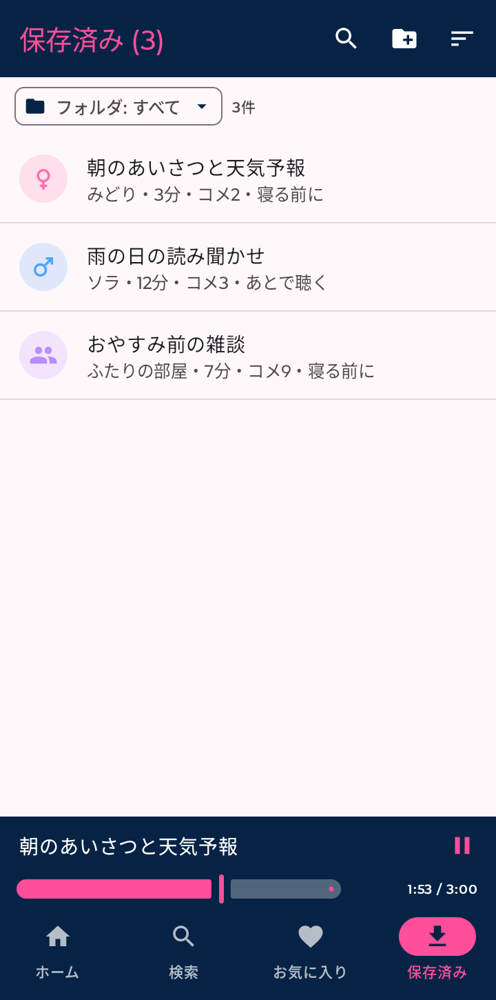
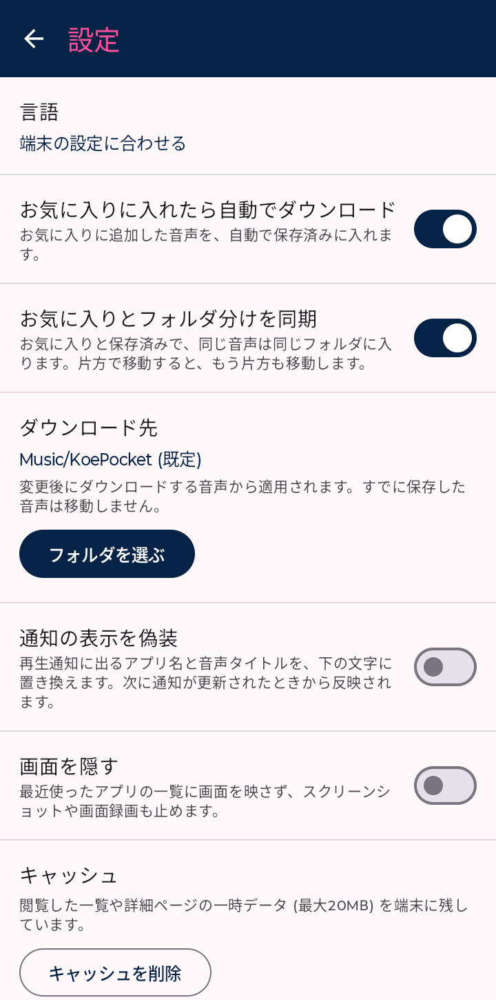

# KoePocket

An unofficial, personal-use Android viewer for the voice board [Koe-Koe](https://koe-koe.com).
Browse, search and play posts, manage favorites and folders, and save audio. It is not affiliated with Koe-Koe's operators or its posters.

**For users aged 18 and over only.** A confirmation screen is shown on first launch.

Project page: https://tabunugoku.github.io/KoePocket/

<p>
  
  
  
  
  
  
  
</p>

The posts shown in the screenshots are dummies made for testing. They are not real posts.

## Installation

1. Download `KoePocket-x.y.z.apk` from [Releases](../../releases).
2. Allow installing apps from unknown sources on your device, then open the APK.
3. If Play Protect shows a prompt, you can choose "Don't send" if you wish.

Requires Android 8.0 (API 26) or later. Not published on Google Play.

## Languages

Supports Japanese, English, Simplified Chinese, Traditional Chinese and Korean. You can switch the language in Settings, independently of the device language. Post titles, bodies, comments and tags are shown in the site's original Japanese.

## Privacy

- Favorites, folders, search history, settings and saved audio are all stored on the device. Nothing is sent externally.
- There are no accounts, analytics or ads. The only server the app talks to is koe-koe.com.
- Audio is saved to `Music/KoePocket` by default (changeable in Settings). Because it lives in the device's music folder, other music and file-manager apps may show it.
- The screen is hidden in the recent-apps list and screenshots (configurable in Settings). The browsing cache can be cleared from Settings.

## Disclaimer

- Copyright of the audio and text belongs to the posters and Koe-Koe. Article 4 of Koe-Koe's [Terms of Use](https://koe-koe.com/kiyaku.php) prohibits unauthorized copying, reposting, public transmission and distribution. Keep saved audio for private use and do not redistribute it.
- This app is free, with no ads or commercial purpose. Because the terms prohibit commercial activity, it will never be paid or ad-supported.
- Follow Koe-Koe's Terms of Use. The app may stop working if the site changes.
- If Koe-Koe's operators make contact, the repository and pages will be taken down.
- Provided as is. The author accepts no liability for any damage arising from its use.

## Build

Requires JDK 17 and the Android SDK.

```
gradlew.bat assembleDebug
```

For release signing, place a `keystore.properties` (`storeFile` / `storePassword` / `keyAlias` / `keyPassword`) in the project root,
and `gradlew.bat assembleRelease` will apply it. This file and the keystore are not included in the repository.

<details>
<summary>日本語 (Japanese)</summary>

# KoePocket

音声掲示板 [Koe-Koe](https://koe-koe.com) を Android で閲覧するための、個人利用向けの非公式ビューアです。
一覧・検索・再生、お気に入りとフォルダ管理、音声の保存ができます。Koe-Koe の運営者・投稿者とは無関係です。

**18歳以上の方のみ利用できます。** 初回起動時に確認画面を出します。

紹介ページ: https://tabunugoku.github.io/KoePocket/

画像に写る投稿は、動作確認用に作ったダミーです。実在の投稿ではありません。

## インストール

1. [Releases](../../releases) から `KoePocket-x.y.z.apk` をダウンロードします。
2. 端末で「提供元不明のアプリ」のインストールを許可して開きます。
3. Play プロテクトの確認が出たら、必要に応じて「送信しない」を選べます。

Android 8.0 (API 26) 以上が必要です。Google Play では公開していません。

## 言語

日本語・English・简体中文・繁體中文・한국어に対応しています。設定の「言語」で、端末の設定とは別に切り替えられます。投稿のタイトル・本文・コメント・タグは、サイトの日本語のまま表示します。

## プライバシー

- お気に入り・フォルダ・検索履歴・設定・保存した音声は、すべて端末内に保存します。外部へ送信しません。
- アカウントや解析・広告はなく、通信先は koe-koe.com のみです。
- 保存先は既定で `Music/KoePocket` です。設定で変更できます。端末の音楽フォルダに置くため、他の音楽アプリやファイル管理アプリにも表示されることがあります。
- 最近使ったアプリの一覧やスクリーンショットには画面を映しません（設定で変更可）。閲覧キャッシュは設定から削除できます。

## 免責

- 音声・文章の著作権は投稿者と Koe-Koe に帰属します。Koe-Koe の[利用規約](https://koe-koe.com/kiyaku.php)第4条は、無断の複製・転載・公衆送信・配布を禁じています。保存した音声は私的利用にとどめ、再配布しないでください。
- このアプリは無料で、広告や営利目的はありません。規約が営利目的の行為を禁じているため、今後も有料化や広告の追加はしません。
- Koe-Koe の利用規約に従ってください。サイト側の変更で動かなくなることがあります。
- Koe-Koe の運営者から連絡があった場合は、リポジトリとページの公開を停止します。
- 現状のまま提供します。利用による損害について作者は責任を負いません。

## ビルド

JDK 17 と Android SDK が必要です。

```
gradlew.bat assembleDebug
```

リリース署名は、ルートに `keystore.properties` (`storeFile` / `storePassword` / `keyAlias` / `keyPassword`) を置くと
`gradlew.bat assembleRelease` で適用されます。このファイルとキーストアはリポジトリに含めません。

</details>
